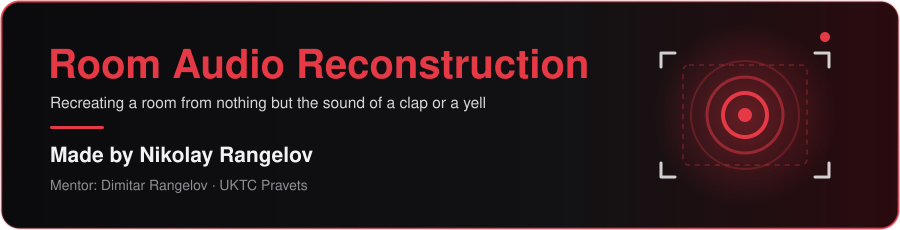

<p align="center">
  
</p>

<p align="center">
  <a href="https://github.com/Izu83" title="Nikolay Rangelov (Izu83)"></a>
  &nbsp;
  <a href="https://github.com/mitkor2" title="Mentor: Dimitar Rangelov (mitkor2)"></a>
  &nbsp;
  <a href="https://uktc-bg.com/" title="UKTC — NPG po KTS Pravets"></a>
</p>

<p align="center">
  
  
  
  
  
  
</p>

## Contents

<p align="center">
  <a href="#about"></a>
  <a href="#how-it-works"></a>
  <a href="#requirements"></a>
  <a href="#running-it"></a>
  <a href="#dataset"></a>
  <a href="#results"></a>
  <a href="#spatial-audio"></a>
  <a href="#calibration"></a>
  <a href="#layout"></a>
  <a href="#limitations"></a>
  <a href="#whats-next"></a>
  <a href="#author"></a>
</p>

---

## About

Every room leaves a fingerprint on sound. Clap your hands and the sound bounces off the floor, the ceiling and the walls; the way it dies away tells you how big the room is and what it is made of.

**Room Audio Reconstruction** takes ordinary phone recordings (a few claps and yells) and works backwards from the sound to the room:

- how long the room rings (**RT60** per frequency band) and what its surfaces are like
- how high the **ceiling** is, from the echo between floor and ceiling
- a best estimate of the **room's size**, with honest uncertainty ranges
- which **side of the phone** each clap or yell came from, and roughly how far away
- an **interactive 3D view** of the reconstructed room, with a clap simulated inside it so you can compare it by ear with the real one

## How it works

```
 iPhone video ──► stereo audio ──► event detection ──► acoustics ──► room model ──► 3D view + report
   (.MOV)          (48 kHz)        onset / decay      RT60, echoes     shoebox fit
                                   clap vs yell       side, distance   + uncertainty
```

1. **Event detection.** Finds each clap or yell, the start of its free decay and the background noise. A clap is told apart from a yell by how long the sound lasts beyond what the reverberation alone would give.
2. **Acoustics.** Reverberation time per octave band from Schroeder backward integration (noise-compensated), plus the direct-to-reverberant ratio and clarity of every clap.
3. **Ceiling height.** The strongest repeating echo in a clap, with a delay of τ = 2L / c, is the floor–ceiling echo.
4. **Room fit.** A shoebox model combines the echo, the Eyring reverberation formula (RT60 ↔ volume and surface) and size priors. Differential evolution finds the best room, and MCMC gives the 90 % ranges.
5. **Side and distance.** The iPhone stereo track works like a coincident virtual microphone pair: the louder channel in the first 10 ms tells which end of the phone the sound came from. The distance comes from the direct-to-reverberant ratio.
6. **Output.** A 3D preview, a report figure, a JSON file with every number, and a clap re-synthesised in the reconstructed room.

## Requirements

- Windows with **Python 3.10+** (the batch files install the rest)
- `numpy`, `scipy`, `matplotlib`, `av` (see [`requirements.txt`](requirements.txt))
- An internet connection when opening the 3D preview (three.js is loaded from a CDN)

## Running it

1. Put the recordings (iPhone `.MOV` videos or `.wav` files) in `data/videos/`.
2. Double-click **`reconstruct.bat`**.

It extracts the audio, analyses every recording and opens `output/room_3d.html`.

```bat
reconstruct.bat                                   :: everything in data\videos
reconstruct.bat data\videos\clap1.MOV other\      :: specific files or folders (drag and drop works too)
python -m roomrecon --help                        :: all options
```

| Output | What it is |
|---|---|
| `room_3d.html` | Interactive 3D view: estimated vs true room, phone and people, distance rings and side arrows, RT60 table, real vs simulated clap audio |
| `report.png` | Room, reverberation per band, energy envelopes, spectrum, size uncertainty, stereo side |
| `summary.txt` / `room.json` | Every number, plus the ground-truth comparison |
| `reconstructed_room_ir.wav` | Impulse response of the reconstructed room |
| `clap_in_reconstructed_room.wav` | A clap played inside the reconstructed room |

## Dataset

Eight iPhone 17 videos recorded in Spatial Audio mode in one room (12.25 × 6.14 × 2.40 m), with the phone lying on a table-tennis table:

| Position | Clap | Yell | Distance to phone |
|---|---|---|---|
| 1 | `clap1` | `yell1` | 4.1 m |
| 2 | `calp2` | `yell2` | 6.3 m |
| 3 | `clap3` | `yell3` | 5.0 m |
| 4 | `clap4` | `yell4` | 7.3 m |

The videos are in [`data/videos/`](data/videos), and their extracted audio is in [`data/audios/`](data/audios). The room and all positions are in [`data/ground_truth/room_coordinates.txt`](data/ground_truth/room_coordinates.txt).

## Results

On the test room, without being given the answer:

| Quantity | Estimate | True | |
|---|---|---|---|
| Ceiling height | 2.44 m | 2.40 m | ✅ 2 % |
| Reverberation (mid bands) | 1.52 s | — | hard, sparsely furnished room ✅ |
| Side of the phone | 6 / 6 confident calls correct | — | ✅ |
| Distance to the person | 3 – 21 % error on 3 of 4 claps | — | ⚠️ low confidence |
| Floor length × width | 5.8 × 5.8 m (90 %: 3.8–12.0 m) | 12.25 × 6.14 m | ❌ not measurable from stereo |

## Spatial audio

iPhone Spatial Audio videos also contain an **APAC** track: 4-channel first-order ambisonics, which records the *direction* every sound and echo comes from. Only Apple's frameworks can decode it. When it is decoded, the program adds the 3D direction of every clap and yell and a millisecond-by-millisecond map of where the echoes come from.

- **With a Mac (macOS 26+; macOS 15 decodes iOS 27 recordings to silence):**
  ```bash
  swift tools/decode_spatial_audio.swift data/videos
  ```
- **Without a Mac**, use a free GitHub-hosted Mac:
  1. Create an empty, private repository.
  2. Run:
     ```bat
     decode_spatial_audio_on_github.bat https://github.com/<you>/<repo>.git
     ```
  3. In the repository's **Actions** tab, download the `spatial-audio` artifact.
  4. Unzip it into `data/spatial/`.

## Calibration

`calibrate.bat` compares the analysis with the ground-truth file and writes `config/calibration.json`, which every later run applies.

- **Default:** keeps only corrections that carry over to other rooms (the distance scale).
- **`calibrate.bat --same-room`:** also copies this room's size into the model. Use it only for more recordings of the same room.

<details>
<summary>Ground-truth file format</summary>

Decimal commas are accepted. Use either one line per key or sections:

```
room: 6.14 2.40 12.25          Room:
phone: 2.56 0.75 4.38          X 6,14
video 1: 1.27 1.70 8.11        Y 2,40
phone_right: 0 0 1             Z 12,25
```

- `video N` matches recordings ending in N (clapN, yellN).
- `phone_right` is the direction the phone's right stereo channel points.
- `--up-axis` sets the vertical axis (default `y`).
</details>

## Layout

```
reconstruct.bat                     run the reconstruction
calibrate.bat                       calibrate against a measured room
decode_spatial_audio_on_github.bat  decode Spatial Audio on a GitHub-hosted Mac
roomrecon/                          Python package  (python -m roomrecon)
├── cli.py            command line and pipeline
├── audio.py          videos, WAV, ambisonics, audio extraction
├── analysis.py       event detection, RT60, DRR, stereo side, echoes
├── spatial.py        direction analysis of ambisonics
├── model.py          shoebox room model, fit, source distance
├── calibration.py    calibration against ground truth
├── truth.py          ground-truth parsing and comparison
├── synthesis.py      impulse response of the reconstructed room
├── report.py         report.png and summary
├── preview.py        room_3d.html
└── templates/        3D view template
config/               calibration.json
data/                 videos/ · audios/ · spatial/ · ground_truth/
tools/                decode_spatial_audio.swift
assets/               banner and logos
.github/workflows/    Spatial Audio decoding job
```

## Limitations

- **Floor length and width cannot be measured** from a single phone's stereo recording. The echoes of distant walls arrive while the room is already full of reverberation, and one microphone pair cannot tell their direction. A speaker sine sweep was tested in simulation and does not solve this either.
- **Distance to the person is rough.** The camera app's audio processing hides the direct sound of a clap, and the program flags this in the output.
- **Stereo gives only one axis.** It tells which end of the phone a sound came from, not the full angle.
- Low-frequency "room mode" peaks in phone recordings turned out to be device and background noise. They are off by default (`--use-modes`).
- Everything has been tested on **one room**. A second measured room is the real test.

## What's next

- Decode the **Spatial Audio** track and turn the echo-direction map into wall positions. This is the most promising route to measuring length and width.
- Record more rooms with tape-measured dimensions and validate across them.
- Record from several spots per room, including positions near each wall.

## Author

<table align="center">
  <tr>
    <td align="center">
      <a href="https://github.com/Izu83"><br><b>Nikolay Rangelov</b></a><br>
      <sub>Author · @Izu83</sub>
    </td>
    <td align="center">
      <a href="https://github.com/mitkor2"><br><b>Dimitar Rangelov</b></a><br>
      <sub>Mentor · @mitkor2</sub>
    </td>
    <td align="center">
      <a href="https://uktc-bg.com/"><br><b>UKTC</b></a><br>
      <sub>NPG po KTS · Pravets</sub>
    </td>
  </tr>
</table>
